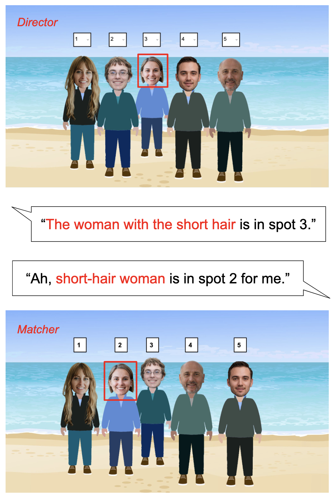
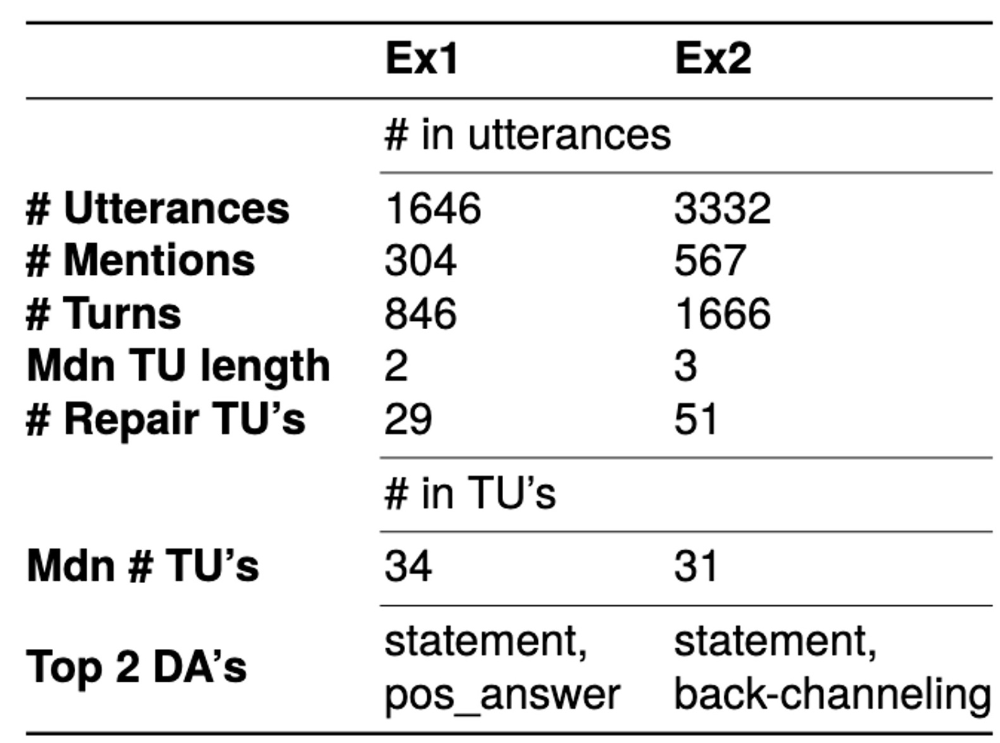

# The SPOTTER Framework

This repository contains code and data for the SPOTTER Framework, a 
framework for investigating convention formation in Human-Robot Interaction,
which is described in the following paper:

`paper citation will appear once available`

If you use our code or data, please cite this paper.

## The SPOTTER game
The SPOTTER game is a two-person reference game. It consists of six rounds
in which the goal is to locate the position of characters in a visual scene.
The visual scene for each player contains the same characters, but they are in
a different order. Players must communicate to find the position of each character
in the other player's picture:

The game is designed to support Human-Robot Interaction. However, it can also be used to
investigate Human-Human Interaction.

## Code
HTML source code for the SPOTTER game can be found in the folder `SPOTTER-game`.

### Versions
There are two versions of the game:
- `version_1` contains the original version which was used in a pilot experiment. This version uses cartoon-like figures. Players also only had to select whether a character was in the *same* or a *different* position.
- `version_2` contains the latest, updated version. The cartoon-like faces have been replaced by more realistic faces. Players now have to select the exact position of a character in the other player's picture.

If you wish to use the framework for your experiments, we recommend to use the latest
version. 

### Gameplay
The game starts from `start_adult.html`. `start_child.html` was used for an additional
version of the game which is simpler so it could be played by children. From the start page,
the html links to each subsequent round.

## Dataset

The folder `dataset` contains the data which was gathered during two Human-Robot Interaction pilot experiments. 
Robot behaviour was 'faked' using the Wizard-of-Oz approach.
The language used in the dataset is Dutch. The data in `version_1` and `version_2` use the gameplay code from their respective folder
in `SPOTTER-game` with the same name. 

### Participants
The dataset contains interactions from 21 participants:
- 7 participants for `version_1`
- 14 participants for `version_2`

Data for each participant is contained in a separate .tsv file.

### Annotation

The dataset contains one **Utterance** per line. Utterances been annotated with the following features:
- **Start**: The start time of an utterance in seconds
- **End**: The end time of an utterance in seconds
- **Text**: The text in the utterance
- **Speaker**: The source of the utterance, either *Human* or *Robot*
- **Mention**: The part of the utterance which contains the description of a character
- **Character**: The gold annotation for the referent of the mention
- **Round**: The round of the game. Any utterances that are not part of a round (i.e. before or in between rounds) are annotated as '0'
- **Transaction Unit**: A unit of the interaction which contains the utterances and turns needed to resolve the mention for one referent and identify them in the picture
- **Transaction Unit Relation**: The relation between subsequent utterances within the same Transaction Unit. For a full list of relations, we refer to Appendix C of our paper.
- **Dialog Act (DA)**: An automatically extracted Dialog Act for the utterance
- **Dialog Act Confidence (DA_conf)**: The confidence score for the automatically extracted Dialog Act

See the table below for quantitative details about the dataset:

